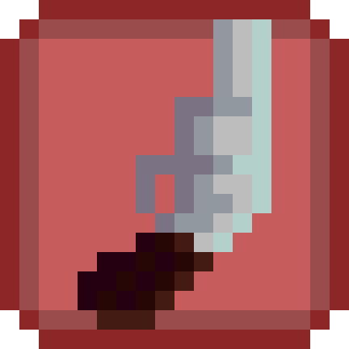

  

  Primeira versão do roleta.russa

  Baixe as versões mais recentes abaixo

  \/

  
  &nbsp;
  

  ( O windows sempre vai bloquear a execução do .exe de primeira pela falta de certificados, e eu nem a pau vou comprar um )

